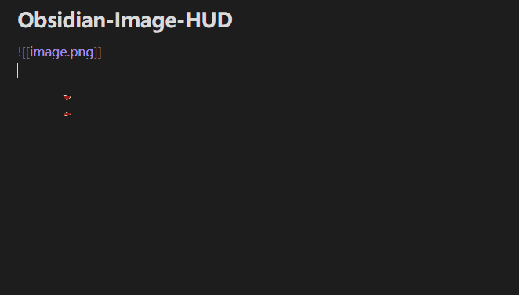

# Obsidian Image HUD

[中文](#中文) | [English](#english)

  

## 简介

**Obsidian Image HUD** 是一个轻量级的编辑器增强插件。它在图片链接旁显示一个非侵入式的悬浮菜单 (HUD)，让你无需离开编辑器即可快速处理图片。

### ✨ 核心功能

*   **� 悬停预览**: 鼠标悬停即可查看图片缩略图、分辨率和文件大小。
*   **⚡ 格式转换**: 一键将图片转换为 **WebP / JPG / PNG**，支持自定义压缩质量和尺寸缩放。
    *   *特性*: 转换后自动保留原链接参数（如 `|100` 或 `#bg`），并生成新文件以便对比。
*   **📋 复制图片**: 一键将图片文件复制到系统剪贴板，方便粘贴到其他应用。
*   **✏️ 外部编辑**: 调用系统默认应用或指定编辑器（如 Photoshop）快速打开图片。
*   **🗑️ 快速管理**: 直接删除图片文件及当前链接。

### 📦 安装

1. 从 [Releases](https://github.com/YourUsername/Obsidian-Image-HUD/releases) 下载最新版本。
2. 解压 `main.js`, `manifest.json`, `styles.css` 到你的仓库插件目录: `.obsidian/plugins/obsidian-image-hud/`。
3. 在 Obsidian 设置中启用插件。

---

## Introduction

**Obsidian Image HUD** is a lightweight plugin that enhances image interaction in editor mode. It displays a non-intrusive floating HUD next to image links, allowing you to manage images without leaving the editor.

### ✨ Features

*   **� Hover Preview**: Quickly view image thumbnail, resolution, and file size on hover.
*   **⚡ Format Conversion**: One-click convert images to **WebP / JPG / PNG** with custom quality and resizing.
    *   *Note*: Preserves original link parameters (e.g., `|100` or `#bg`) and creates new files non-destructively.
*   **📋 Copy to Clipboard**: One-click copy the image file to system clipboard.
*   **✏️ External Editing**: Open images in system default viewer or a custom editor (e.g., Photoshop).
*   **🗑️ Quick Delete**: Delete the image file and its link directly.

### 📦 Installation

1. Download the latest release from [Releases](https://github.com/YourUsername/Obsidian-Image-HUD/releases).
2. Extract `main.js`, `manifest.json`, and `styles.css` to your vault's plugin folder: `.obsidian/plugins/obsidian-image-hud/`.
3. Enable the plugin in Obsidian settings.
